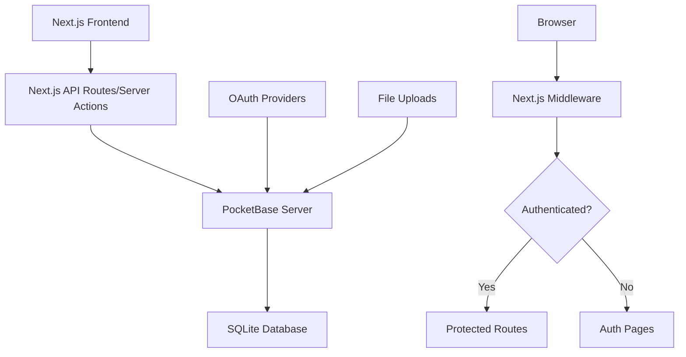

# WARP.md

This file provides guidance to WARP (warp.dev) when working with code in this repository.

## Project Overview

Optix Toolkit is a Next.js web application for DNHS Team Optix 3749 robotics team management. It provides features for outreach tracking, scouting forms, and team member management using PocketBase as the backend database and authentication system.

## Essential Commands

### Development
```bash
# Start development server with Turbopack
bun run dev
# or
bun dev

# Build for production
bun run build

# Start production server
bun start

# Lint code
bun run lint
```

### PocketBase Operations
```bash
# Start PocketBase server (from otoolkit-pb directory)
cd otoolkit-pb
wsl ./LocalStart.sh  # On Linux/Mac
# or manually: pb serve --dir=. --dev

# PocketBase runs on port 30090 (default)
```

## Architecture Overview



The application uses:
- **Next.js 15** with App Router for the frontend
- **PocketBase** as the backend API and authentication system
- **SQLite** database managed by PocketBase
- **Next.js Middleware** for route protection based on user roles
- **Server Actions** for server-side data operations

## Tech Stack

### Frontend
- **Next.js 15** - React framework with App Router
- **React 19** - UI library
- **TypeScript** - Type safety
- **Tailwind CSS** - Styling with custom configuration
- **shadcn/ui** - Component library (New York variant)
- **Lucide React** - Icons

### State Management & Data Fetching
- **Zustand** - Client-side state management
- **SWR** - Data fetching and caching
- **React Hook Form** - Form handling

### Backend & Database
- **PocketBase** - Backend as a Service
- **SQLite** - Database (managed by PocketBase)

### UI Components
- **shadcn/ui** - UI Components
- **Radix UI** - Headless UI primitives
- **Recharts** - Data visualization
- **Sonner** - Toast notifications
- **Vaul** - Drawer component

### Development Tools
- **ESLint** - Code linting with Next.js config
- **Turbopack** - Fast bundler for development
- **Faker.js** - Test data generation

## Project Structure

```
src/
├── app/                    # Next.js App Router pages
│   ├── layout.tsx         # Root layout with Navbar
│   ├── page.tsx           # Root page (redirects to /outreach)
│   ├── outreach/          # Outreach tracking pages
│   ├── scouting/          # Robot scouting forms
│   ├── testing/           # Admin testing pages
│   └── auth/              # Authentication pages
├── components/            # Reusable React components
│   ├── ui/               # shadcn/ui components
│   └── skeletons/        # Loading state components
├── hooks/                # Custom React hooks
├── lib/                  # Utility functions and configurations
│   ├── db/              # Database operation helpers
│   ├── tests/           # Test utilities
│   ├── pbaseClient.ts   # Client-side PocketBase config
│   ├── pbaseServer.ts   # Server-side PocketBase operations
│   └── types.ts         # TypeScript type definitions
└── middleware.ts         # Route protection middleware

otoolkit-pb/              # PocketBase configuration
├── pb_migrations/        # Database migrations
└── LocalStart.sh        # PocketBase startup script
```

## Authentication & Middleware

### Authentication Flow
- PocketBase handles authentication with OAuth providers (Google, Discord)
- JWT tokens stored in `pb_auth` cookie
- Client-side: `pbaseClient.ts` manages auth state
- Server-side: `pbaseServer.ts` handles auth validation

### Route Protection
The middleware (`src/middleware.ts`) protects routes based on user roles:

**Admin-only routes:**
- `/admin`
- `/testing`
- `/outreach/manage-events`

**Authenticated routes:**
- `/dashboard`
- `/profile`
- `/settings`
- `/outreach`
- `/build`
- `/scouting`

### User Roles
- `admin` - Full access to all features
- `member` - Access to standard features
- `guest` - Limited access

## Database Schema & PocketBase

### Key Collections
- **users** - User accounts with roles and OAuth integration
- **UserData** - Extended user data (outreach/build minutes)
- **OutreachEvents** - Outreach event definitions
- **OutreachSessions** - User participation in outreach events
- **Settings** - Application configuration

### Type Definitions
All PocketBase collections have corresponding TypeScript interfaces in `src/lib/types.ts`:
- `pbCol_Users`
- `pbCol_UserData`
- `pbCol_OutreachEvents`
- `pbCol_OutreachSessions`
- `pbCol_Settings`

### Migrations
Database schema changes are managed through PocketBase migrations in `otoolkit-pb/pb_migrations/`.

## Development Workflow

### Environment Setup
1. Clone the repository
2. Install dependencies: `bun install`
3. Set up environment variables (create `.env.local`):
   ```bash
   NEXT_PUBLIC_PB_URL=http://localhost:30090
   ```
4. Start PocketBase server from `otoolkit-pb/` directory
5. Start Next.js development server: `npm run dev`

### Common Development Tasks
- **Adding new pages**: Create in `src/app/` following App Router conventions
- **New components**: Add to `src/components/` with proper TypeScript types
- **Database changes**: Create PocketBase migrations
- **UI components**: Use shadcn/ui CLI to add new components

### Code Conventions
- Use TypeScript for all new code
- Follow ESLint configuration (warns on unused vars, prefers const)
- Components use PascalCase, files use camelCase
- Use `@/` path alias for imports from `src/`

### Testing & Development
- Faker.js available for generating test data (`src/lib/tests/faker.ts`)
- Testing page available at `/testing` for admins
- Use browser dev tools and PocketBase admin interface for debugging

## Important Notes

### Dark Mode
Application is configured to use dark mode by default (`className="dark"` in layout).

### Font Configuration
Uses Geist font family from Google Fonts with CSS variable `--font-geist-sans`.

### Performance
- Turbopack enabled for faster development builds
- Next.js 15 features utilized for improved performance
- Image optimization through Next.js built-in features
